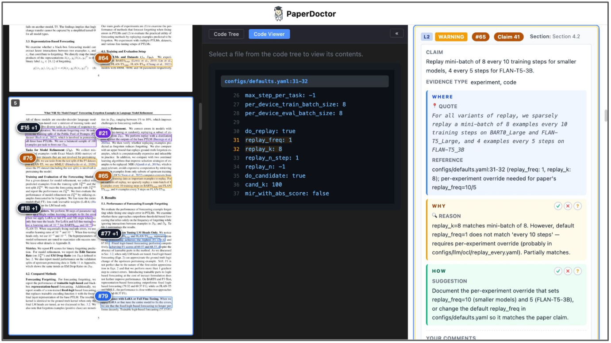

<p align="center">
  
</p>

<h1 align="center">Paperdoctor</h1>

<p align="center"><b>Evidence-Grounded and Actionable Feedback for Scientific Papers in Progress</b></p>

<p align="center">
  <a href="https://paperdoctor.github.io">🌐 Website</a> ·
  <a href="">📝 Paper</a> ·
  <a href="">📜 MIT License</a>
</p>

> University of Oxford · Stanford University · National University of Singapore · University of Washington · University of Cambridge

Evidence-grounded paper review and verification agent. It compares a paper's claims against its code, math, experiments, prior work, references, and visual layout — then renders every finding into a single interactive report.

<p align="center">
  
</p>

Each stage is a [Claude Code skill](skills/) (`SKILL.md`) backed by a small set of Python tools in [`tools/`](tools/). All artifacts for a paper live under a single `papers/<paper_dir>/` directory.

## Workflow

```text
prepare-paper                                    → metadata/
      │
      │  Phase 1 (parallel)
      ├── read-claim ──→ reports/check_claim.json
      ├── read-txt   ──→ reports/check_txt.json
      ├── read-vis   ──→ reports/check_vis.json
      ├── read-bib   ──→ reports/check_bib.json
      │
      │  Phase 2 (parallel, after read-claim)
      ├── read-code   ──→ reports/check_code.json
      ├── read-theory ──→ reports/check_theory.json
      ├── read-prior  ──→ reports/check_prior.json
      ├── read-exp    ──→ reports/check_exp.json
      │
      │  Phase 3 (manual, requires user approval)
      └── run-exp     ──→ updates reports/check_exp.json
      │
      │  Report (after Phase 2, or after Phase 3)
      └── vis-preview ──→ display/paperdoctor.html
```

## Skills

| Skill | Input | Output | What it does |
|---|---|---|---|
| prepare-paper | PDF + codebase | `metadata/` | Parse PDF to markdown, render page images, index code |
| read-claim | paper text | `reports/check_claim.json` | Extract all verifiable claims (explicit, implicit, cross-reference) |
| read-txt | paper text | `reports/check_txt.json` | Check writing quality — grammar, typos, phrasing, terminology |
| read-code | check_claim.json + code | `reports/check_code.json` | Verify `code` claims against the codebase |
| read-theory | check_claim.json + paper text | `reports/check_theory.json` | Verify `theoretical` claims — math, proofs, formal arguments |
| read-prior | check_claim.json + web | `reports/check_prior.json` | Verify `related_work` claims — baselines, novelty, cited facts |
| read-bib | references.json + web | `reports/check_bib.json` | Verify each cited reference exists |
| read-exp | check_claim.json + README | `reports/check_exp.json` | Review experiment design + prioritize a reproduction plan |
| read-vis | page images | `reports/check_vis.json` | Check layout, figures, tables, spacing |
| run-exp | check_exp.json + check_code.json | updates `reports/check_exp.json` | Create env, run experiments, compare against paper numbers |
| vis-preview | all check_*.json + PDF | `display/paperdoctor.html` | Three-panel HTML report: PDF pages · code viewer · findings |

## Execution Order

```text
Phase 1 (parallel):  read-claim, read-txt, read-vis, read-bib
Phase 2 (parallel):  read-code, read-theory, read-prior, read-exp  (need check_claim.json)
Phase 3 (manual):    run-exp  (needs check_exp.json + check_code.json + user approval)
Report:              vis-preview  (after Phase 2 or Phase 3)
```

## Quick Start

```text
/prepare-paper papers/my_paper

# Phase 1 (parallel)
/read-claim papers/my_paper      # ─┐
/read-txt papers/my_paper        #  ├─ parallel
/read-vis papers/my_paper        #  │
/read-bib papers/my_paper        # ─┘

# Phase 2 (parallel, after read-claim)
/read-code papers/my_paper       # ─┐
/read-theory papers/my_paper     #  ├─ parallel
/read-prior papers/my_paper      #  │
/read-exp papers/my_paper        # ─┘

# Phase 3 (requires user approval)
/run-exp papers/my_paper

# Report (after Phase 2, or after Phase 3)
/vis-preview papers/my_paper
```

## Tools

The skills call these helpers under [`tools/`](tools/); you can also run them directly.

| Tool | Usage |
|---|---|
| `api_mathpix.py` | Parse a PDF to markdown + images via Mathpix (preferred): `python tools/api_mathpix.py papers/xxx/paper.pdf` |
| `api_mineru.py` | MinerU fallback parser: `python tools/api_mineru.py -p paper.pdf -o papers/xxx/metadata` |
| `organize_paper.py` | Build `metadata/paper/full.md`, `references.json`, and `sections/`: `python tools/organize_paper.py --paper-file paper.pdf` |
| `pdf_render.py` | Render PDF pages to PNGs: `python tools/pdf_render.py paper.pdf` |
| `code_analyzer.py` | Index a codebase (tree-sitter AST): `python tools/code_analyzer.py <repo> --output papers/xxx/metadata/code/index.json` |
| `pdf_search.py` | Locate quotes in a PDF: `python tools/pdf_search.py paper.pdf quotes.json` |
| `merge_reports.py` | Merge all `check_*.json` into `review.json`: `python tools/merge_reports.py papers/xxx` |
| `build_review.py` | Generate the vis-preview report: `python tools/build_review.py papers/xxx` |

## Repo Structure

```text
paperdoctor/
├── skills/              # Skill definitions (one SKILL.md each)
│   ├── prepare-paper/
│   ├── read-claim/
│   ├── read-txt/
│   ├── read-code/
│   ├── read-theory/
│   ├── read-prior/
│   ├── read-bib/
│   ├── read-exp/
│   ├── read-vis/
│   ├── run-exp/
│   └── vis-preview/
├── tools/               # Python utilities called by the skills
├── papers/              # Per-paper inputs and outputs (metadata/, reports/, display/)
├── assets/
└── requirements.txt
```

Per-paper layout produced by the pipeline:

```text
papers/<paper_dir>/
├── <paper>.pdf
├── metadata/            # parsed markdown, page images, code index
├── reports/             # check_*.json from each read-* skill
└── display/             # paperdoctor.html report
```

## Install

```bash
pip install -r requirements.txt
```
